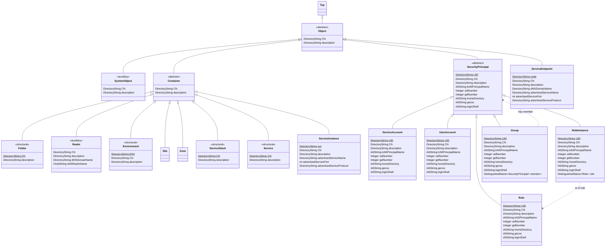

# Identity and Access Management (IAM) service stack

## Contents

1. [Introduction](#introduction)
2. [Design goals](#design-goals)
3. [Certificate authorities and purposes](#certificate-authorities-and-purposes)
4. [Object model](#object-model)
5. [~~Replication~~ (TBC)](#replication)
6. [~~Scaling~~ (TBC)](#performance-resources-and-scaling)
7. [~~Integration~~ (TBC)](#integration)
8. [Local testing & development](#local-testing--development)
9. [Standards and references](#standards-and-references)
10. [Appendices](#appendices)

## Introduction

### What is it?

This stack contains:

* `ds`: an LDAP directory service (OpenLDAP)
* `kdc`: an authentication service (Heimdal Kerberos V KDC)
* `kadmin`: a Kerberos administration server (Heimdal Kerberos V kadmind)
* ~~certificate authorities (Step)~~ (these are no longer included in the core stack for flexibility)
* TODO: RADIUS accounting service

 It is **NOT** remotely production-ready

There's no kpasswdd because user accounts (and indeed ideally service accounts)
should use PKINIT.

In addition to the above, to support development and integration testing,
additional services are defined to optionally bootstrap a complete public-key
infrastructure (PKI), key/secrets management service, and a container
configured as a typical Linux client.

### What is it for?

This stack provides the identity and access management services for my own
personal wide-area network (WAN), and so supports a very small number of users
across a much larger number of commodity devices, spread across multiple
physical locations.

It is not intended to be a _product_, least of all one anybody else uses,
although the intent is that it is maintained and operated in line with best
practices in order to make my life easier.

### Quick start

```
$ make rebuild
$ make client-shell
```

See *[Local testing & development](#local-testing--development)* for more information.

## Design goals

### The Directory is the source of truth

*See also: [Object model](#object-model)*

The focal point of this stack is the directory service, `ds`. As is typical, the
purpose of the directory service is to be the so-called "single source of
truth" across a realm, containing information not only about user and
service accounts, roles, and groups, but also physical and virtual sites,
devices, certificates and certificate authorities, mail distribution lists,
and so on.

Necessarily, a somewhat opinionated approach has been taken with regards to
how information in the directory is structured. Hopefully, over time, more
flexibility can be afforded as administration tools are developed.

OpenLDAP's `slapd` provides the directory service engine. It is open source,
stable, robust, well-understood (there are books about it), and speaks the
industry-standard LDAP protocol with a range of access-control and
authentication options including use of mutual TLS.

### Kerberos provides authentication

The directory service does not perform authentication itself. Instead, this
is delegated to either a Kerberos realm, or a (X.509/PKIX) certificate
authority.

The Kerberos authentication services (`kdc` and `kadmin`) use the Heimdal
Kerberos implementation, configured to use the directory service as its
database. Thus, Kerberos services can operate anywhere a replica of the
directory service is available.

Kerberos is implemented in all major operating systems (both mobile and
desktop) and is an integral component of both Microsoft Active Directory
and Apple Open Directory. NFSv4 uses Kerberos to provide a strong
security layer to network-available shared storage.

### No secret material persisted on disk

User accounts and role instances (and where possible service accounts)
will not be protected by passwords, and the goal is to eliminate all
secret material from being persisted on disk anywhere in the stack
(where secret material must be persisted, that ideally will be via a
hardware token). Accounts will be authenticated by proving access to a
private key, which translates to inserting a token (e.g., YubiKey,
Smartcard) and entering the unlock PIN.

### Certificates as standard

*See also: [Certificate Authorities and Purposes](#certificate-authorities-and-purposes)*

Digital certificates are a copy of a portion of information from the
directory, digitally signed for a fixed period (or until revoked) to
allow the receiver to verify their validity. Typically, the information
conveyed in a certificate is, in effect, "the entity which controls the
private key for this certificate corresponds to this named entry in the
directory"—in other words, for identification.

However, this extends to any kind of entity in the directory, not only
to people or service accounts.

Implementing public/private-key-based authentication requires operating a
properly-configured certificate authority and configuring the Kerberos KDC
to trust that authority.

The certificate authorities in this stack are instances of StepCA, which
is a modern, highly-configurable certificate authority implementation
designed for use in both cloud and on-premises configurations.

### Role-based access control

Access control is role-based, and we adhere to the Kerberos pattern of
creating per-user-role _instances_ with their own authentication
requirements, such as `joe/admin`. These are created as subsidiary
objects of the relevant user account, and have their own Kerberos
principal name but do not have their own numeric user and group ID (i.e.,
they are not separate accounts as Posix applications understand them).

As with user accounts, role instances also are authenticated using
a security token and PIN: a certificate is issued to the user which is
stored on their token (or for some roles, on a different token), and may
even be protected by a different PIN to their usual identity.

### Lightweight and portable

This stack should be easily deployable to low-cost commodity hardware
and to lower-spec compute instances offered by major cloud providers.

### Standards-based and interoperable

*See also: [Standards and references](#standards-and-references)*

This stack is intended to be used by clients running a range of
operating systems (particularly Linux, macOS, iOS, and Android),
and afford integration with other services (such as NFS and a DHCP
server), and do so with relatively light configuration and following
standard patterns where possible.

## Certificate authorities and purposes


Certificates within a realm are routinely issued to:

* People (ordinary user accounts)
* Service groups (e.g., Identity and access management) and Services (e.g., Directory Service) within an environment
* Individual service nodes (service accounts, e.g., NFS on server25)
* Roles
* Role instances (e.g., `joe/admin`)
* Network hosts (physical and virtual machines) and containers
* Point-to-Point VPN endpoints

In effect, certification happens wherever a relationship between two entities in the directory needs to be cryptographically-verifiable as part of a protocol exchange (often, mutual identification as part of establishing a TLS connection).

The `iamdev` stack seeks to simulate an ideal public-key infrastructure (PKI)
setup, which is described below, although the stack could be integrated with
any functioning PKI.

### Offline certificate authorities (A1, B1, X1)

There are two "offline" root and one intermediate CAs, A1, B1, and X1,
respectively. The private keys for each are stored on separate hardware
security tokens, each having different PINs, and can be stored in
separate locations.

Wherever possible, systems are configured to trust both root A1 and B1
together.

Because the root CA keys are stored on hardware tokens (and marked
non-extractable), having a pair of keys provides a safety net: if either
of the two keys is lost, the other can be used to bring a replacement
into service (i.e., A2 or B2).

A1's and B1's keys are both used to sign the same certificate request
generated when X1 is initialised. In other words, X1 is identified by
two identical CA certificates containing its public key, one issued
by A1, and one issued by B1: whichever the client trusts, subordinates
of X1 will be considered valid.

(A1 and B1 actually also cross-sign each other, but it's unclear if
this is useful).

X1 is used to issue a small number of other certificates. One of these
in development only is the certificate for `kms`, the Vault instance—this
is because we need to bootstrap the KMS (configured properly for TLS)
before any of the online (Step) CAs are available.

### Provisioning CA

The Provisioning CA exists to issue a form of bearer token which can be
exchanged for a different kind of credential or bootstrap an authentication
process. For example, hosts configured to access the directory server
need to present a client certificate to do so, and the process of
authenticating a user may involve accessing the directory (depending upon
the client configuration), and so the certificate issued to it by the
Provisioning CA is used for this purpose.

In development, the Provisioning CA is a Step-CA instance with an ACME
provisioner configured that will issue certificates bearing the SAN of
any host that can pass the ACME `http-01` challenge within the stack (i.e.,
any of the running containers).

In production, certificates might be issued manually by a Provisioning
CA (e.g., not using ACME or similar at all), or be issued only to devices
which have completed an enrolment process and possess some kind of
shared secret, but the specifics are beyond the scope of this README.

In development, mirroring a typical production setup, certificates issued by
the Provisioning CA are restricted in their `keyUsage` and `extendedKeyUsage`,
to ensure that they cannot be used as server certificates, and they
contain an extension with a dummy value to mark them as a provisioning
certificate.

The specifics of these certificates are a compromise between Step-CA's
capabilities (in the context of an ACME provisioning flow, at least), and the
requirements of the servers which will be configured to accept them. In an
ideal world, the rules defining what is and isn't an acceptable client
certificate in a particular context would be expressed in a flexible but
very standard formulation, such that teaching a server about an extension
that it should pass without problem when marked as "Critical" would be
a trivial task (and not involving code changes).

The Provisioning CA is not restricted to devices: in particular, it can
be used as part of the provisioning process for a new hardware security
token: shortly after initialisation, a provisioning certificate is issued
to (and stored on) the token. That token provisioning certificate can then
be used to enrol the token for a particular user account through a
self-service process.

### Infrastructure CA

The infrastructure CA issues certificates to services which form part of
the realm infrastructure, such as the directory server, and the Kerberos
KDC (whose certificate must include specific extensions to support PKINIT).

### User CA

The User CA issues certificates for user accounts in the directory. User
certificates tend to have long lifetimes and be ideally only kept on
hardware security tokens such as YubiKeys or smartcards.

User certificates encode the Kerberos principal of the user and should
be compatible with Smartcard Login on macOS / Windows or equivalent PAM
modules, including supporting local on-demand account creation and
automatic Kerberos ticket initialisation.

In other words, when a user provides their token and enters the correct
PIN, any properly configured client host (e.g., a workstation) will create
a local account (if required), mount any network home directory specified
in their directory entry, and obtain a Kerberos ticket.

Open source platforms (Linux, FreeBSD, etc.) offer the further possibility
of using information from the certificate as a fallback for when the
directory service is unavailable, such as logging into a laptop for the
first time in an area with limited connectivity (obviously if the
certificate has been revoked, then that will impair any actual to
resources once that laptop is back online).

## Object model

As the directory service is provided by OpenLDAP, which aims to conform to the
LDAP standards, the realm data model is broadly defined here in LDAP terms.

### Object Identifiers

An Object Identifier, or more commonly, an OID, is a standard, globally-unique,
hierarchical system of identifiers used extensively by the ITU in the X.500
family of standards, and forms an integral part of LDAP, X.509 PKI, and SNMP,
amongst others. OIDs are registration-based, and operates a federated
registration model, so there are multiple ways to obtain an OID. Once an OID
"arc" is assigned to you/your organisation, you are free to create any
assignments within that as needed.

**Under no circumstances can you invent arbitrary Object Identifiers**

In human-readable form, OIDs consist of a series of non-negative integers
separated by "." (dots), similar in appearance to IP addresses. Unlike IP
addresses, OIDs can be any of any length and its constituent integers can
in principle be very large numbers, but in practice this is rare.

OIDs can be expressed as URIs [in the form of `urn:oid:…` URNs](https://datatracker.ietf.org/doc/html/rfc3001),
but this is rarely-used in the wild.

OIDs have several standardised binary forms, but in particular that defined
by the standard Distinguished Encoding Rules (DER) is most widely-used, in
that it features in many Internet protocol exchanges (and corresponding
file formats) where OIDs are passed between systems.

OIDs are used within the directory service to identify data types (syntaxes),
properties (attribute types), and (object) classes. They're also used within
certificates to identify key usages, policies, and extensions.

Although some of the classes and attributes defined here are assigned
specifically for this stack, many are defined by external standards and
included for reference with their assigned OIDs.

### Data types (Syntaxes)

The following syntaxes are supported by [OpenLDAP](https://www.openldap.org/doc/admin26/schema.html):

  Type               | OID                           | Description
 --------------------|-------------------------------|--------------
  `Boolean`          | 1.3.6.1.4.1.1466.115.121.1.7  | boolean value
  `DirectoryString`  | 1.3.6.1.4.1.1466.115.121.1.15 | UTF-8-encoded string
  `DN`               | 1.3.6.1.4.1.1466.115.121.1.12 | distinguished name
  `Integer`          | 1.3.6.1.4.1.1466.115.121.1.27 | integer value
  `NumericString`    | 1.3.6.1.4.1.1466.115.121.1.36 | string containing a numeric value
  `OID`              | 1.3.6.1.4.1.1466.115.121.1.38 | Object Identifier
  `OctetString`      | 1.3.6.1.4.1.1466.115.121.1.40 | arbitrary binary octets
  `PrintableString`  | 1.3.6.1.4.1.1466.115.121.1.44 |
  `CountryString`    | 1.3.6.1.4.1.1466.115.121.1.11 | encoded as `DirectoryString`
  `Guide`            | 1.3.6.1.4.1.1466.115.121.1.25 |
  `IA5String`        | 1.3.6.1.4.1.1466.115.121.1.26 | 7-bit ASCII string
  `PostalAddress`    | 1.3.6.1.4.1.1466.115.121.1.41 | encoded as a `SEQUENCE` of `DirectoryString`s

### Properties (Attribute Types)

In LDAP terms, properties (attribute types) are defined up-front before the
classes that reference them. This means that the `description` property, for
example, is defined throughout the directory as meaning the same thing,
regardless of what type of object it appears on. This may feel constraining
if you're used to software development, where a property with a particular
name could be a boolean in one class and a string in another (in theory),
but this approach helps to ensure consistent handling of data within the
directory by the applications that use it.

  Property                                | Source     | Type                  | OID
 -----------------------------------------|------------|-----------------------|------
  `objectClass`                           | X.500      | `OID`                 | 2.5.4.0
  `DN` or `distinguishedName`             | X.500      | `DN`                  | 2.5.4.49
 | + `seeAlso`                            | X.500      | _(`DN`)_              | 2.5.4.34
  `aliasedObjectName`                     | X.500      | `DN`                  | 2.5.4.1
  `knowledgeInformation`                  | X.500      | `DirectoryString`     | 2.5.4.2
  `name`                                  | X.500      | `DirectoryString`     | 2.5.4.41
 | + `CN` or `commonName`                 | X.500      | _(`DirectoryString`)_ | 2.5.4.3
 | + `SN` or `surname`                    | X.500      | _(`DirectoryString`)_ | 2.5.4.4
 | + `L` or `locality`                    | X.500      | _(`DirectoryString`)_ | 2.5.4.7
 | + `ST` or `stateOrProvinceName`        | X.500      | _(`DirectoryString`)_ | 2.5.4.8
  `serialNumber`                          | X.500      | `PrintableString`     | 2.5.4.5
  `C` or `country`                        | X.500      | `CountryString`       | 2.5.4.6
  `street` or `streetAddress`             | X.500      | `DirectoryString`     | 2.5.4.9
  `description` or `multiLineDescription` | X.500      | `DirectoryString`     | 2.5.4.13
  `searchGuide`                           | X.500      | `Guide`               | 2.5.4.14
  `businessCategory`                      | X.500      | `DirectoryString`     | 2.5.4.15
  `postalAddress`                         | X.500      | `PostalAddress`       | 2.5.4.16
  `postalCode`                            | X.500      | `DirectoryString`     | 2.5.4.17
  `uidNumber`                             | RFC 2307   | `Integer`             | 1.3.6.1.1.1.1.0
  `gidNumber`                             | RFC 2307   | `Integer`             | 1.3.6.1.1.1.1.1
  `gecos`                                 | RFC 2307   | `IA5String`           | 1.3.6.1.1.1.1.2
  `homeDirectory`                         | RFC 2307   | `IA5String`           | 1.3.6.1.1.1.1.3
  `loginShell`                            | RFC 2307   | `IA5String`           | 1.3.6.1.1.1.1.4
  `shadowLastChange`                      | RFC 2307   | `Integer`             | 1.3.6.1.1.1.1.5
  `shadowMin`                             | RFC 2307   | `Integer`             | 1.3.6.1.1.1.1.6
  `shadowMax`                             | RFC 2307   | `Integer`             | 1.3.6.1.1.1.1.7
  `shadowWarning`                         | RFC 2307   | `Integer`             | 1.3.6.1.1.1.1.8
  `shadowInactive`                        | RFC 2307   | `Integer`             | 1.3.6.1.1.1.1.9
  `shadowExpire`                          | RFC 2307   | `Integer`             | 1.3.6.1.1.1.1.10
  `shadowFlag`                            | RFC 2307   | `Integer`             | 1.3.6.1.1.1.1.11
  `memberUid`                             | RFC 2307   | `IA5String`           | 1.3.6.1.1.1.1.12
  `memberNisNetgroup`                     | RFC 2307   | `IA5String`           | 1.3.6.1.1.1.1.13
  

### Class overview

#### X.500 Classes


#### IAM classes



### Core object classes


`Object` is an abstract class which is the used as the ancestor of all key
types of object within the directory. It allows, but does not require, a
`CN` (or `commonName`) and a `description` to be set: this means that every
object within the directoy _may_ have a `CN` and a `description`; many will
omit either or both.

`CN` is a convenient generic naming property, and can be used to form a
`DN` (or `distinguishedName`). Typically, the `CN` corresponds to something's
"display name".

`SystemObject` is an auxiliary class applied to objects whose lifecycle is
managed internally by the system rather than explicitly by an administrator,
and so by implication a `SystemObject` cannot be renamed, moved, or deleted,
although its contents can typically be manipulated as normal.

### Containers and Folders

```mermaid
classDiagram

  class Container {
    <<abstract>>
    DirectoryString CN
    DirectoryString description
  }

  Top <|-- Object
  Object <|-- Container

  class Folder {
    <<structural>>
    DirectoryString CN$
    DirectoryString description
  }

  class Realm {
    ::
    (described below)
  }

  class Environment {
    ::
    (described below)
  }

  class Site {
    ::
    (described below)
  }

  class Zone {
    ::
    (described below)
  }

  Container <|-- Folder
  Container <|-- Realm
  Container <|-- Environment
  Container <|-- Site
  Container <|-- Zone
```

A `Container` is a generic, but abstract, container of other objects.
Subclasses of `Container` represent different kinds of container used within
the directory:

* `Folder`: a general-purose container, which must have a `CN`, and can generally be created anywhere within the directory where there's a need to group objects not met by other classes
* `Realm` (described in detail below): the top-level container for all objects within a realm
* `Environment` (described in detail below): an isolated security domain within a realm
* `Site` and `Zone` (described in detail below): a way of grouping resources by physical location and logical network topology

 They must have a Common
Name (`CN`), and may have a `description`. `Container`s can generally be
created anywhere within the directory where there're a requirement to group
objects that doesn't fit the semantics of another class (e.g., `organizationalUnit`)


### Realm


A `Realm` represents the top-level container for everything within a single management realm. It's an auxiliary class, and so is typically added to an `Organization` or `OrganizationalUnit` instance (although a realm could in principle be an instance of any structural object).

 A `Realm` inherits from `Container` and may additionally have `dNSDomainName` (representing the primary DNS domain name for the realm), and `krb5RealmName` (typically an all-uppercase version of `dNSDomainName` but may not be in all cases); the latter two will always be present under normal circumstances for a properly-functioning realm.

### Security Principals


A `SecurityPrincipal` represents any entity that has its own security identity and there are a number of subclasses for different kinds of principal:

* `UserAccount`: an account issued to a person
* `Role`: a defined role which confers access to resources
* `RoleInstance`: an instance of a role conferred upon a particular user account (corresponding to Kerberos principals of the form _principal/instance@REALM_)
* `ServiceAccount`: an account used by a network service in order to access other resources
* `Group`: a group of accounts

Not all properties apply usefully to all kinds of account, but an account must have a `UID` and may have a `CN`, `description`, `uidNumber`, `gidNumber`, `homeDirectory`, `loginShell`, `gecos`, and `krb5PrincipalName`

`SecurityPrincipal`s are typically also instances of `krb5Principal` and `krb5KDCEntry`, and may also be members of other well-known classes such as `inetOrgPerson`, `posixAccount`, `posixGroup`, etc.


### Environments and services


A `Realm` may contain any number of `Environment`s. Whilst objects can
generally be created anywhere within the directory, `Environments` are
a mechanism for partitioning a realm into co-existing sets of services,
along with their own `SecurityPrincipals`, segregated from any equivalents
which may exist in any other environments.

When a `Realm` is initialised, a default environment called `Infrastructure`
is created to hold the service definitions for those services which can be
considered core infrastructure of the realm, such as the directory and the
Kerberos KDC services, but additional `Environment`s can be created
arbitrarily.

Each `Environment` can contain
`Service`s, and which are made up of one or more `ServiceInstance`s, which
represents the availability of particular protocol. Each `ServiceInstance` is then
in turn served by any number of `ServiceNode`s, which are reachable endpoints
where that protocol is available to clients.

`Service`s may be grouped together into `ServiceGroup`s for convenience, such as
an "Identity Management" group.

Although not shown on the diagram above, `Environment`s can contain other
kinds of object besides `Service`s and `ServiceGroup`s: for example.

### Example Realm Tree

The diagram below shows the basic structure of a populated directory for a realm.


## Replication

TBC.

## Performance, resources, and scaling

TBC.

## Integration

TBC.

## Local testing & development

In addition to the core stack definition in `docker-compose.yaml`, there are
a number of additional YAML files which are used if you invoke the
`dev-compose` wrapper script. In addition to the OpenLDAP directory server
and Kerberos KDC, these files also define:

* An enterprise-style PKI with two "offline" root and a cross-signed intermediate CA
* A set of emulated hardware security modules (HSMs) which can be attached to containers (such as the offline CAs)
* An instance of Hashicorp Vault to act as a secrets/key manager (KMS)
* Setup and configuration for the online CAs so that they are integrated with the PKI and Vault

```mermaid
flowchart
  subgraph offline ["Offline Test PKI"]

    subgraph a1 ["Root CA A1"]
      direction LR
      root_a1[root-a1] --> pkcs_a1[(pkcs-a1)]
      hsm_a1[hsm-a1] --> pkcs_a1
    end

    subgraph b1 ["Root CA B1"]
      direction LR
      root_b1[root-b1] --> pkcs_b1[(pkcs-b1)]
      hsm_b1[hsm-b1] --> pkcs_b1
    end

%%    a1 -. signs .-> x1
%%    b1 -. signs .-> x1

    subgraph x1 ["Intermediate CA X1"]
      direction LR
      inter_x1[inter-x1] --> pkcs_x1[(pkcs-x1)];
      hsm_x1[hsm-x1] --> pkcs_x1;
    end

  end
  
  subgraph kms_env ["Test KMS"]
    kms;
  end

  subgraph online_ca ["Online Test PKI"]
    x1 --> kms
    prov_ca --> kms
    infra_ca --> kms
    user_ca --> kms
  end

%%    x1 -. signs .-> prov_ca[prov-ca]
%%    x1 -. signs .-> infra_ca[infra-ca]
%%    x1 -. signs .-> user_ca[user-ca]

  subgraph iam_core ["IAM core"]
    ds; kdc; kadmin;
    ds --> slaprun[(slaprun)];
    kdc --> slaprun;
    kadmin --> slaprun;

    %% infra_ca -. issues .-> ds & kdc;
    kdc & kadmin --> kms;
  end

  subgraph inner [" "]
    subgraph client_env ["Client"]
      direction LR
      client --> pkcs11_user[(pkcs11-user)];
      hsm_user[hsm-user] --> pkcs11_user;
    end
    client_env --> ds & kdc;

    subgraph admin_env ["Adminstrator"]
      direction LR
      admin --> pkcs11_admin[(pkcs11-admin)];
      hsm_admin[hsm-admin] --> pkcs11_admin;
    end
    admin_env --> ds & kdc & kadmin;
  end

  ```


All of this should bootstrap automatically. On an M1 MacBook Pro, a full stack
takes between 30-60 seconds to reach a healthy state across the board from a
standing start (i.e., freshly initialising a realm and all secrets from
scratch), assuming the container images are already built. This can be made
faster if you're willing to make healthchecks more aggressive.

There is no requirement that all, or even any, of this is replicated in a
production deployment of the stack: the main requirement is that there
is a functioning PKI. If that's handled entirely externally, then that
should work just fine, although over time more functionality will
rely on being able to issue and validate various different kinds of
certificates beyond those implemented so far.

To get started, see the top-level `Makefile` for a set of useful targets --
they should be fairly self-explanatory. The quickest way to bootstrap
a development environment is to run:—

```
make rebuild
```

This will (re)build the container images and bring up a test instance, with a
Compose project name of `iamdev` and storing data in `./dev/data` and
`./dev/secrets`. Note that `./dev/data` is removed by `make clean` but
`./dev/secrets` is not removed unless you run `make fullclean`.

`make rebuild` is exactly the same as running:

```
./dev-compose build
./dev-compose up -V --wait client
````

By default (see the `dev-compose` script itself for more information), this is
the same as running:

```
docker compose --project-name iamdev -f docker-compose.yaml -f dev/hsm.yaml -f dev/root-ca.yaml -f dev/inter-ca.yaml -f dev/kms.yaml -f dev/prov-ca.yaml -f dev/infra-ca.yaml -f dev/user-ca.yaml -f dev/client.yaml -f dev/overrides.yaml -f dev/local.yaml build

docker compose --project-name iamdev -f docker-compose.yaml -f dev/hsm.yaml -f dev/root-ca.yaml -f dev/inter-ca.yaml -f dev/kms.yaml -f dev/prov-ca.yaml -f dev/infra-ca.yaml -f dev/user-ca.yaml -f dev/client.yaml -f dev/overrides.yaml -f dev/local.yaml up -V --wait client
```

The initial user account (and its associated role instances) are created based
upon values set in `dev/dev.env`. By default, this creates a user named `me`
with a password set to `password`, who can administer Kerberos via a
`me/admin` principal with a password set to `admin`. Longer-term both should use
X.509 certificates and PKINIT in place of passwords.

See `ds/templates/40-accounts.ldif.in` for this account's template.

The `dev` container which is brought up is configured to perform NSS LDAP lookups
and for PAM to authenticate with Kerberos. Use the `dev-logs` target to view the
debug output from the LDAP client daemon, `nslcd`, use `dev-shell` for a standard
root shell within the container, and `dev-login` to test PAM authentication.

```
$ make dev-login
docker compose --project-name=iamdev -f docker-compose.yaml -f dev/dev.yaml exec -it dev /bin/login
fe5a241b6e83 login: me
Password: 
Linux fe5a241b6e83 5.10.124-linuxkit #1 SMP PREEMPT Thu Jun 30 08:18:26 UTC 2022 aarch64

The programs included with the Debian GNU/Linux system are free software;
the exact distribution terms for each program are described in the
individual files in /usr/share/doc/*/copyright.

Debian GNU/Linux comes with ABSOLUTELY NO WARRANTY, to the extent
permitted by applicable law.
me@fe5a241b6e83:~$ klist
Credentials cache: FILE:/tmp/krb5cc_5000_nVDTRb
        Principal: me@EXAMPLE.COM

  Issued                Expires               Principal
Sep 23 15:43:00 2022  Sep 24 15:43:00 2022  krbtgt/EXAMPLE.COM@EXAMPLE.COM
me@fe5a241b6e83:~$ id
uid=5000(me) gid=5000(Test User) groups=5000(Test User),20000(All users)
me@fe5a241b6e83:~$ finger me
Login: me                               Name: Test User
Directory: /me                          Shell: /bin/bash
On since Fri Sep 23 15:43 (UTC) on pts/0   2 seconds idle
     (messages off)
No mail.
No Plan.
me@fe5a241b6e83:~$ who
me       pts/0        Sep 23 15:43
me@fe5a241b6e83:~$ pwd
/me
me@fe5a241b6e83:~$ kadmin
kadmin> list *
me/admin@EXAMPLE.COM's Password: 
me
me/admin
krbtgt/EXAMPLE.COM
kadmin/admin
kadmin> get me
            Principal: me@EXAMPLE.COM
    Principal expires: never
     Password expires: never
 Last password change: 2022-09-23 15:42:54 UTC
      Max ticket life: unlimited
   Max renewable life: unlimited
                 Kvno: 1
                Mkvno: unknown
Last successful login: never
    Last failed login: never
   Failed login count: 0
        Last modified: 2022-09-23 15:42:54 UTC
             Modifier: unknown
           Attributes: 
             Keytypes: aes256-cts-hmac-sha1-96(pw-salt)[1], des3-cbc-sha1(pw-salt)[1], arcfour-hmac-md5(pw-salt)[1]
          PK-INIT ACL: 
              Aliases: 

kadmin> exit
me@fe5a241b6e83:~$ exit
logout
$ 
```

## Standards and references

### ITU-T Recommendations

Much of the stack is defined by initially the ITU-T X.500 family of
recommendations, which were originally intended to define a complete, global,
interconnected directory-based infrastructure. Whilst this did not ever
reach fruition, the following recommendations form the basis of standards
followed today:

  Document | Title
 ----------|--------
  X.509    | The Directory: Public-key and attribute certificate frameworks
  X.520    | The Directory: Selected attribute types
  X.521    | The Directory: Selected object classes
  X.690    | ASN.1 encoding rules: Specification of Basic Encoding Rules (BER), Canonical Encoding Rules (CER) and Distinguished Encoding Rules (DER)

### Lightweight Directory Access Protocol (LDAP)

In practice, the primary reference material governing this stack are the IETF
RFCs defining the Lightweight Directory Access Protocol (LDAP), which replaces
the Directory Access Protocol defined by X.500:

  Document  | Date      | Title
 -----------|-----------|--------
  RFC 2589  | 1999-05   | Lightweight Directory Access Protocol (v3): Extensions for Dynamic Directory Services
  RFC 4510  | 2006-06   | Lightweight Directory Access Protocol (LDAP): Technical Specification Road Map
  RFC 4511  | 2006-06   | LDAP: The Protocol
  RFC 4512  | 2006-06   | LDAP: Directory Information Models
  RFC 4513  | 2006-06   | LDAP: Authentication Methods and Security Mechanisms
  RFC 4514  | 2006-06   | LDAP: String Representation of Distinguished Names
  RFC 4515  | 2006-06   | LDAP: String Representation of Search Filters
  RFC 4516  | 2006-06   | LDAP: Uniform Resource Locator
  RFC 4517  | 2006-06   | LDAP: Syntaxes and Matching Rules
  RFC 4518  | 2006-06   | LDAP: Internationalized String Preparation
  RFC 4519  | 2006-06   | LDAP: Schema for User Applications

A number of historical RFCs are made reference to, which are listed here:

  Document  | Date      | See also | Title
 -----------|-----------|----------|--------
  RFC 1274  | 1991-11   | RFC 4524 | The COSINE and Internet X.500 Schema
  RFC 2252  | 1997-12   | RFC 4510 | Lightweight Directory Access Protocol (v3): Attribute Syntax Definitions
  RFC 2256  | 1997-12   | RFC 4510 | A Summary of the X.500(96) User Schema for use with LDAPv3
  RFC 2587  | 1999-06   | RFC 4523 | Internet X.509 Public Key Infrastructure LDAPv2 Schema
  RFC 2830  | 2000-05   | RFC 4513 | Lightweight Directory Access Protocol (v3): Extension for Transport Layer Security
  RFC 3377  | 2002-09   | RFC 4510 | Lightweight Directory Access Protocol (v3): Technical Specification

### Additional LDAP schema definitions and references

  Document    | Date      | Title
 -------------|-----------|--------
  RFC 2079    | 1997-01   | Definition of an X.500 Attribute Type and an Object Class to Hold Uniform Resource Identifiers (URIs)
  RFC 2247    | 1998-01   | Using Domains in LDAP/X.500 Distinguished Names
  RFC 2307    | 1998-03   | An Approach for Using LDAP as a Network Information Service
  RFC 2377    | 1998-09   | Naming Plan for Internet Directory-Enabled Applications
  RFC 2798    | 2000-04   | Definition of the inetOrgPerson LDAP Object Class
  RFC 4523    | 2006-06   | LDAP: Schema Definitions for X.509 Certificates
  RFC 4524    | 2006-06   | COSINE LDAP/X.500 Schema
  hdb.schema  | 2015-09   | Heimdal: Definitions for a Kerberos V KDC schema

### Internet X.509 Public Key Infrastructure and Transport Layer Security

Current:

  RFC         | Date      | Title
 -------------|-----------|--------
  RFC 5280    | 2008-05   | Internet X.509 Public Key Infrastructure Certificate and Certificate Revocation List (CRL) Profile
  RFC 6960    | 2013-06   | X.509 Internet Public Key Infrastructure Online Certificate Status Protocol - OCSP
  RFC 8446    | 2018-08   | The Transport Layer Security (TLS) Protocol Version 1.3

Historical:

  RFC         | Date      | See also | Title
 -------------|-----------|----------|--------
  RFC 3280    | 2002-04   | RFC 5280 | Internet X.509 Public Key Infrastructure Certificate and Certificate Revocation List (CRL) Profile

## Appendices

### To-do list

1. ds: Run container as unprivileged user
2. ds: Run container with read-only root
3. ~~When running with compose, mount volume for socket~~
4. ds: schema updates + local schema overrides???
5. ~~kdc: wait for ds availability~~
6. kdc: fail better on initialisation
7. ds: ~~indices~~, database config (cross-check against DB_CONFIG)
8. admin tools
9. healthchecks
10. unify scripts
11. better logging (add some logging functions...)
12. integrity/consistency checks
13. map `gidNumber=0+uidNumber=0,cn=peercred,cn=external,cn=auth` to something nicer
14. ~~does Heimdal HDB support LDAP connections over TCP/mTLS?~~ according to the code, yes, although it isn't obvious how to supply a client certificate
15. online CA configurations (infra services, users… + ~~throwaway root in dev~~)
16. ~~kadmin: why is `hdb-ldap-create-base` ignored~~ **SOLUTION**: create users via LDAP first, and perform key management and attribute changes via `kadmin`
17. ~~ALL: database directories only need to be shared by certain containers~~
18. ALL: tidy up environment variables
19. ~~kdc: initialise with --bare (just add krbtgt); add other entries via LDAP and then `kadmin -l modify`, etc.~~
20. ~~kdc: expand search scope~~
21. ~~dev: working pam-krb5 and nss-ldap (authenticating the "admin" user)~~
22. ~~kdc: separate passwords for admin and admin/admin (duh)~~
23. ~~swap admin and admin/admin for templated $name and $name/admin~~
24. ds: ACLs ACLs ACLs
25. ds: replica bootstrap
26. kdc: mkey in KMS (verify that mkey is even used)
27. kdc: listen on non-default port so that it can run unprivileged
28. ALL: certificate renewals !!
29. ds, kdc: certificate revocations!
30. ds, kdc, kadmin, client: minimal deployment with mini-ca & how to use externally-provided certs

### Heimdal hdb-ldap options

From [hdp-ldap.c](https://github.com/heimdal/heimdal/blob/8b0c7ec09a167e37fb6f7626cf0a633174e30184/lib/hdb/hdb-ldap.c#L1907):-

* `kdc`.`hdb-ldap-url` (string)
* `kdc`.`hdb-ldap-structural-object` (string)
* `kdc`.`hdb-samba-forwardable` (boolean)
* `kdc`.`hdb-ldap-secret-file` (string)
* `kdc`.`hdb-ldap-bind-dn` (string)
* `kdc`.`hdb-ldap-bind-password` (string)
* `kdc`.`hdb-ldap-start-tls` (boolean)
* `kdc`.`hdb-ldap-create-base` (string)

### OpenLDAP debugging levels

| Level    | Keyword        | Description                                    |
| -------- | -------------- | ---------------------------------------------- |
|     -1   | any            | enable all debugging                           |
|       0  |                | no debugging                                   |
|       1  | (0x1 trace)    | trace function calls                           |
|       2  | (0x2 packets)  | debug packet handling                          |
|       4  | (0x4 args)     | heavy trace debugging                          |
|       8  | (0x8 conns)    | connection management                          |
|      16  | (0x10 BER)     | print out packets sent and received            |
|      32  | (0x20 filter)  | search filter processing                       |
|      64  | (0x40 config)  | configuration processing                       |
|     128  | (0x80 ACL)     | access control list processing                 |
|     256  | (0x100 stats)  | stats log connections/operations/results       |
|     512  | (0x200 stats2) | stats log entries sent                         |
|    1024  | (0x400 shell)  | print communication with shell backends        |
|    2048  | (0x800 parse)  | print entry parsing debugging                  |
|   16384  | (0x4000 sync)  | syncrepl consumer processing                   |
|   32768  | (0x8000 none)  | only highest-priority messages (always logged) |
